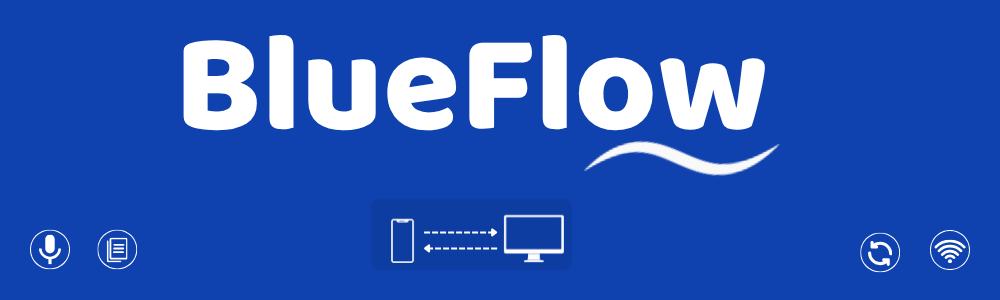

<p align="center">
  
</p>

<h3 align="center">Your phone is your microphone.</h3>
<p align="center">
  Turn your smartphone into a wireless PC microphone over WiFi — no hardware, no cloud, no cost.
</p>

<p align="center">
  
  
  
  
</p>

---

## The Problem

Millions of PC users don't have a microphone. Voice calls on Zoom, AI voice assistants, voice recording — all blocked by *"No microphone detected."* Buying a mic costs money. But **every phone already has a great mic.**

## The Solution

**BlueFlow** bridges your phone's microphone to your PC over WiFi. Your PC sees it as a real, connected microphone — Zoom, Discord, Google Meet, and any other app just works.

---

## ✨ Features

| Feature | Details |
|---------|---------|
| 🎙 **Virtual Microphone** | Phone mic appears as a real mic on your PC |
| 📝 **Live Transcription** | Real-time voice-to-text (offline, via Vosk) |
| 📱 **Zero Phone Install** | Phone just opens a web page — no app store needed |
| 📶 **WiFi Connection** | Low-latency audio over your local network |
| 🔒 **100% Offline** | No cloud, no data leaves your network |
| 📋 **Copy Transcription** | Copy-paste your spoken text from the dashboard |
| 🔗 **QR Code Connect** | Scan and connect in 2 seconds |

---

## 🏗 Architecture

```
📱 Phone (Browser)                        💻 PC (Python Server)
┌──────────────────┐                     ┌─────────────────────────────┐
│                  │    WiFi/WebSocket    │                             │
│  Mic Capture     │ ──── PCM Audio ───▶ │  Audio Router               │
│  (AudioWorklet)  │     (binary)        │  (sounddevice)              │
│                  │                     │       │                     │
│  Permission      │                     │       ├──▶ VB-Cable ──▶ Apps│
│  Handling        │                     │       │    (Virtual Mic)    │
│                  │                     │       │                     │
│  Live Text ◀─────│◀── JSON ──────────  │       └──▶ Vosk STT        │
│  Display         │   (transcription)   │            (offline)        │
└──────────────────┘                     │                             │
                                         │  Dashboard UI               │
                                         │  (QR, status, transcription)│
                                         └─────────────────────────────┘
```

**Audio format:** PCM 16-bit, 16kHz, mono · **Transport:** WebSocket (binary frames) · **Virtual driver:** VB-Cable

---

## 📦 Prerequisites

| Requirement | Link | Notes |
|-------------|------|-------|
| **Python 3.11+** | [python.org](https://python.org) | Make sure `pip` is available |
| **VB-Cable** | [vb-audio.com/Cable](https://vb-audio.com/Cable/) | Run installer as Admin, restart PC |
| **Vosk Model** | [alphacephei.com/vosk/models](https://alphacephei.com/vosk/models) | Download `vosk-model-small-en-us-0.15` (~40MB) |

---

## 🚀 Setup

```bash
# 1. Clone the repo
git clone https://github.com/your-username/BlueFlow.git
cd BlueFlow

# 2. Create & activate virtual environment
python -m venv .venv
.\.venv\Scripts\activate        # Windows

# 3. Install dependencies
pip install -r requirements.txt

# 4. Place Vosk model
#    Extract the downloaded model into the models/ folder:
#    BlueFlow/models/vosk-model-small-en-us-0.15/

# 5. Run!
python run.py
```

---

## 📱 Usage

<table>
<tr>
<td width="50%">

### On your PC
1. Run `python run.py`
2. Dashboard opens automatically
3. QR code is displayed
4. Select **"CABLE Output"** as mic in Zoom/Discord/Meet

</td>
<td width="50%">

### On your Phone
1. Connect to the **same WiFi** as your PC
2. **Scan the QR code** with your camera
3. Tap **"Advanced → Proceed"** (SSL warning, one-time)
4. Tap the **🎙 mic button**
5. Grant microphone permission
6. **Start talking!**

</td>
</tr>
</table>

> **Tip:** In Zoom/Discord, go to Settings → Audio → Microphone and select **"CABLE Output (VB-Audio Virtual Cable)"**

---

## 🗂 Project Structure

```
BlueFlow/
├── run.py                  # Entry point
├── server/                 # Python backend
│   ├── app.py              # FastAPI server + WebSocket handlers
│   ├── audio_router.py     # Routes audio to VB-Cable
│   ├── transcriber.py      # Vosk offline speech-to-text
│   ├── device_manager.py   # Finds VB-Cable device
│   ├── ssl_manager.py      # Self-signed HTTPS cert generator
│   └── config.py           # Constants
├── mobile/                 # Phone client (served as web page)
│   ├── index.html          # Mic UI + permission modal
│   ├── css/mobile.css
│   └── js/
│       ├── mobile.js       # Mic capture + WebSocket
│       └── audio-processor.js  # AudioWorklet (PCM)
├── ui/                     # PC dashboard
│   ├── index.html          # Dashboard UI
│   ├── css/dashboard.css
│   └── js/dashboard.js
├── models/                 # Vosk model (user downloads)
└── requirements.txt
```

---

## 🔧 Troubleshooting

| Issue | Fix |
|-------|-----|
| Mic permission denied on phone | Tap 🔒 in address bar → Permissions → Microphone → Allow |
| VB-Cable not detected | Install VB-Cable, restart PC, then run BlueFlow |
| No sound in Zoom/Discord | Set mic to **"CABLE Output"** in the app's audio settings |
| Phone can't reach PC | Both must be on the same WiFi network |
| SSL warning on phone | Tap "Advanced" → "Proceed" — it's your own local server |

---

## 📄 License

MIT — free to use, modify, and distribute.

---

<p align="center">
  <strong>Built to solve a real problem for people who can't afford a microphone.</strong>
</p>
